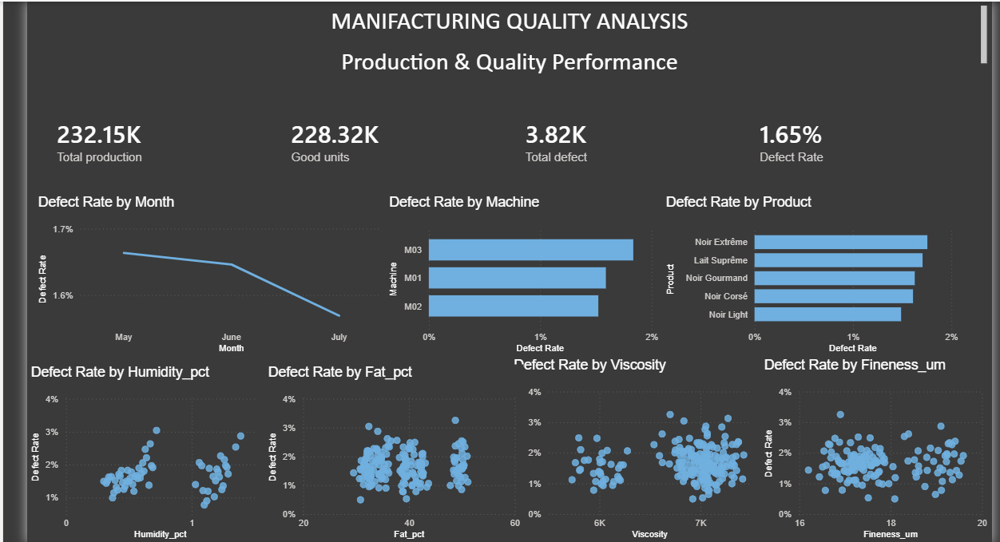

# Project 01 — Manufacturing Quality & Defect Analysis

## Overview

A chocolate manufacturing operation wants to understand production quality performance and identify where elevated defect rates require attention.

This project demonstrates an end-to-end **Excel → Power BI → DAX** analytics workflow using a synthetic production dataset.

> **Dataset note:** The dataset is synthetic and was created specifically for this portfolio project. It does not represent confidential or real company production data.

## Business objectives

- Measure overall production and quality performance.
- Track defect-rate evolution over time.
- Compare quality performance across products and machines.
- Explore relationships between quality parameters and defects.
- Prioritize areas for operational investigation.
- Communicate findings through an interactive Power BI dashboard.

## Dataset

The dataset contains **460 batch-level production records** covering five chocolate products, three machines and five operators.

| Field | Description |
|---|---|
| Date | Production date |
| Product | Chocolate product |
| Batch | Unique production batch |
| Production_Qty | Units produced |
| Defects | Defective units |
| Humidity_pct | Product humidity (%) |
| Fat_pct | Fat content (%) |
| Viscosity | Viscosity measurement |
| Fineness_um | Particle fineness (µm) |
| Production_Time_h | Production duration (hours) |
| Operator | Production operator |
| Machine | Production machine |

Full definitions are available in [`data/data-dictionary.md`](data/data-dictionary.md).

### Data note

The source dataset is available as [`data/production_data.csv`](data/production_data.csv) (460 batch-level records). The Power BI dashboard was built from this source file. The dataset is synthetic and was created specifically for this portfolio project.

> **Dashboard screenshot note:** The preview image in the assets folder shows a filtered view (a subset of months) for visual clarity. The full dataset covers the entire production period and is available in the CSV file.

## KPIs

| KPI | Result |
|---|---:|
| **Total Production** | **532,362** |
| **Good Units** | **523,673** |
| **Total Defects** | **8,689** |
| **Defect Rate** | **1.63%** |

### KPI definitions

```DAX
Total Production = SUM(Production_Data[Production_Qty])

Total Defects = SUM(Production_Data[Defects])

Good Units = [Total Production] - [Total Defects]

Defect Rate =
DIVIDE([Total Defects], [Total Production], 0)
```

## Dashboard

The Power BI dashboard follows three analytical questions:

**What happened?** — KPI cards and monthly defect-rate trend.

**Where is it happening?** — Product and machine comparisons.

**What might explain it?** — Exploratory analysis of humidity, fat percentage, viscosity and fineness.

## Dashboard Preview



*Power BI dashboard — production and quality performance overview.*

## Key findings

### Machine performance

M03 has the highest overall defect rate at **1.84%**, compared with **1.59% for M01** and **1.52% for M02**. M03 also has the highest defect rate for four of the five products.

This identifies **M03 as the primary area for operational investigation**, but the analysis does not claim that M03 causes the defects.

### Product performance

Noir Extrême records the highest product-level defect rate in the dashboard, while Noir Light records the lowest.

### Quality parameters

The exploratory visuals show no obvious positive relationship between defect rate and fat percentage, viscosity or fineness. Humidity shows a possible relationship in parts of the dataset, but additional statistical validation would be required before treating it as a meaningful driver.

## Recommendations

1. **Prioritize M03 for calibration, maintenance and operating-condition review.** M03 has the highest overall defect rate at **1.84%** and the highest rate for four of the five products. In a real production environment, the next step would be to quantify the cost of these additional defects — scrap cost, rework time, and any customer-return exposure — to prioritize the investigation against other operational demands.

2. Compare machines under equivalent product conditions.

3. Review M03 performance by product rather than relying only on aggregate rates.

4. Investigate production-time and operator effects.

5. In a real production environment, enrich the dataset with maintenance events, downtime, temperature, process settings and shift information. With downtime data available, the same dataset could support an **OEE (Overall Equipment Effectiveness)** calculation using Availability (operating time / available time), Performance (actual / planned output), and Quality (good units / total output).

## Tools

- **Microsoft Excel** — source data and validation
- **Microsoft Power BI** — data modeling and dashboarding
- **DAX** — KPI measures

## Project documentation

- [Analysis findings](analysis/findings.md)
- [Analysis methodology](analysis/methodology.md)
- [Power BI dashboard](power-bi/dashboard.md)
- [DAX measures](power-bi/dax-measures.md)
- [Data dictionary](data/data-dictionary.md)
