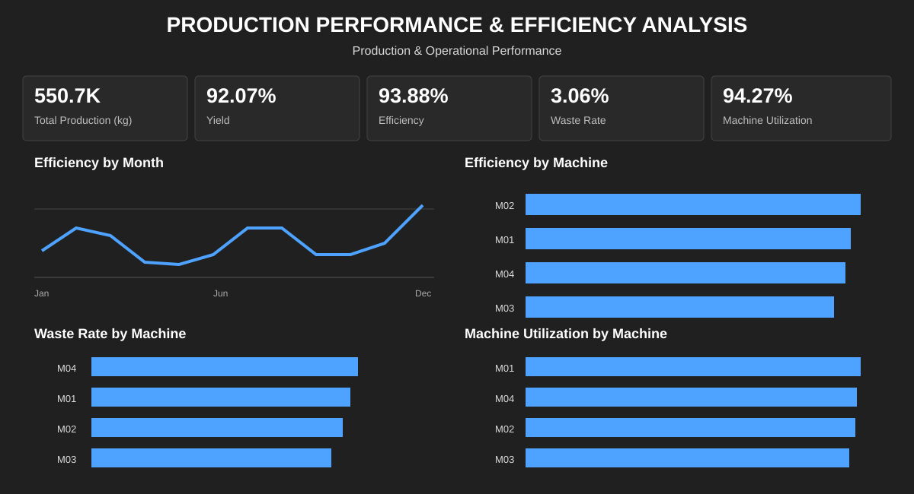

# Project 02 — Production Performance & Efficiency Analysis

## Overview

A food manufacturing operation wants to understand how efficiently it converts planned production capacity and raw inputs into good output. The analysis focuses on production efficiency, yield, waste and machine utilization, then breaks performance down by month, machine, product and shift.

This project demonstrates an end-to-end **Excel → Power BI → DAX** workflow using a synthetic manufacturing dataset.

> **Dataset note:** The data is synthetic and was created specifically for this portfolio project. It does not represent confidential or real company production data.

## Business objectives

- Measure overall production performance.
- Compare actual production with planned production.
- Monitor yield and production waste.
- Measure machine utilization.
- Identify machines, products, shifts and periods with weaker performance.
- Turn dashboard observations into operational recommendations.

## Dataset

The dataset contains **500 batch-level production records** across 5 chocolate products, 4 machines, 3 shifts and 8 operators during 2025.

See [`data/data-dictionary.md`](data/data-dictionary.md) for field definitions.

## KPI definitions

| KPI | Definition |
|---|---|
| Total Production | Sum of actual production (kg) |
| Yield | Good Output ÷ Input Quantity |
| Production Efficiency | Actual Production ÷ Planned Production |
| Waste Rate | Waste ÷ Input Quantity |
| Machine Utilization | Operating Time ÷ Available Time |

## Overall results

| KPI | Result |
|---|---|
| Total Production | **550,695 kg** |
| Planned Production | **586,622 kg** |
| Production Gap | **−35,927 kg** |
| Yield | **92.07%** |
| Production Efficiency | **93.88%** |
| Waste Rate | **3.06%** |
| Machine Utilization | **94.27%** |
| Total Downtime | **13,753.8 min** |
| Energy Consumption | **60,250.2 kWh** |
| **OEE** (Availability × Performance × Quality) | **86.29%** |

### OEE breakdown
- **Availability:** 94.27% (operating time / available time)
- **Performance:** 93.88% (actual production / planned production)
- **Quality:** 97.50% (good output / actual production)
- **Overall OEE:** 86.29% — meaning roughly 13.7% of planned good output is lost to the combined effect of downtime, under-performance, and defects.

## Dashboard

## Key findings

1. **M03 is the main operational priority:** lowest OEE (**83.8%** vs. 87.4% for M02), lowest efficiency (**93.18%**) and utilization (**92.27%**), plus the highest downtime (**4,823.5 min**, 35.1% of total). M03's OEE loss of ~25,227 kg of potential good output is the largest of any machine.

2. **M04 has the highest waste rate at 3.19%.** Its utilization remains relatively high, so waste should be investigated separately from machine usage. Its OEE (86.3%) is closer to the average than M03's.

3. **May is the weakest month for efficiency at 92.98%** (OEE 85.8%), while December is strongest at 95.18% efficiency (OEE 87.5%).

4. **Noir Extrême has the lowest product-level efficiency at 92.98%.**

5. **The morning shift has the highest waste rate at 3.21%.**

6. **Overall OEE is 86.29%**, meaning 13.71% of planned good output is lost. Availability (94.27%) and Performance (93.88%) are the larger loss drivers than Quality (97.50%), which means the biggest improvement opportunity is in reducing downtime and closing the actual-to-planned production gap, not in reducing defects (which are already at a relatively low 2.5% loss rate).

7. Overall actual production is **35,927 kg below plan**, corresponding to **93.88% production efficiency**.

## Interpretation and limitations

The dashboard identifies performance differences and investigation priorities; it does not establish root cause. The synthetic dataset does not contain maintenance events, downtime reason codes or process-setting variables needed to prove causality.

## Recommendations

1. **Prioritize M03 for maintenance, calibration and operating-condition review.** M03 has the lowest OEE (83.8%) and the highest downtime (4,823.5 min, 35.1% of total). M03's OEE loss represents approximately 25,227 kg of potential good output — the largest machine-level loss in the dataset. Reducing M03's downtime to the M02 level (3,014 min) would directly recover a substantial portion of this gap.

2. **Investigate M04 waste causes separately from utilization.** M04 has relatively high utilization (94.75%) but the highest waste rate (3.19%). This suggests material or process losses rather than availability problems.

3. Compare May and December operating conditions. The OEE gap between May (85.8%) and December (87.5%) is 1.7 percentage points — identifying what drove December's stronger performance could reveal repeatable improvement actions.

4. Analyze product-machine combinations before making product-specific process changes.

5. Review morning-shift startup and setup practices, given the highest waste rate (3.21%).

6. In a real deployment, enrich the data with maintenance events, downtime reasons, process settings and raw-material context. The OEE framework already separates Availability, Performance and Quality losses; the next step is to attribute each loss to a specific cause.

## Tools

- **Microsoft Excel** — source data and validation
- **Microsoft Power BI** — data modeling and dashboarding
- **DAX** — KPI measures

## Project documentation

- [Analysis findings](analysis/findings.md)
- [Methodology](analysis/methodology.md)
- [Data dictionary](data/data-dictionary.md)
- [Data notes](data/README.md)
- [Dashboard documentation](power-bi/dashboard.md)
- [DAX measures](power-bi/dax-measures.md)
- [Power BI project notes](power-bi/README.md)
- [Dashboard assets](assets/README.md)
