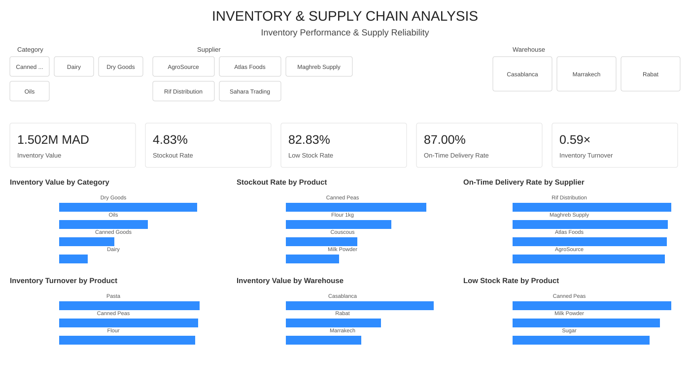

# Project 03 — Inventory & Supply Chain Analysis

## Overview

This project analyzes inventory levels, stockout risk, supplier reliability and inventory movement using a synthetic retail inventory dataset for 2025.

The goal is to turn operational inventory records into a Power BI dashboard that helps answer:

- How much inventory value is currently held?
- Which products are most exposed to stockouts or low-stock conditions?
- Which suppliers have the weakest on-time delivery performance?
- How is inventory distributed across warehouses and categories?
- How quickly is inventory moving?

This project demonstrates an end-to-end **Excel → Power BI → DAX → business insights** workflow.

> **Dataset note:** The dataset is synthetic and was created for portfolio/learning purposes. It does not represent confidential or real company data.

## Business objectives

- Monitor total inventory value.
- Measure stockout and low-stock exposure.
- Evaluate supplier on-time delivery.
- Compare inventory turnover across products.
- Identify warehouses and categories with high inventory concentration.
- Translate dashboard observations into operational recommendations.

## Dataset

The dataset contains **600 inventory records** covering **January–December 2025**.

It includes:

- 10 products
- 4 categories
- 5 suppliers
- 3 warehouses
- Opening and closing stock
- Units received and sold
- Reorder points
- Stockout days
- Lead time
- Unit cost
- Orders placed
- Late-delivery indicator

See [data dictionary](data/data-dictionary.md) for field definitions.

## KPI definitions

| KPI | Definition |
|---|---|
| Inventory Value | Sum of closing stock units × unit cost |
| Stockout Rate | Share of records with at least one stockout day |
| Low Stock Rate | Share of records where closing stock is below the reorder point |
| On-Time Delivery Rate | Share of records without a late-delivery flag |
| Inventory Turnover | Cost-weighted units sold divided by cost-weighted average inventory based on opening and closing stock |

## Dashboard

The dashboard includes:

- Inventory Value by Category
- Stockout Rate by Product
- On-Time Delivery Rate by Supplier
- Inventory Turnover by Product
- Inventory Value by Warehouse
- Low Stock Rate by Product

Interactive filters are provided for **Category, Supplier and Warehouse**.

## Key findings

1. **Inventory value is approximately 1.502M MAD.** Casablanca holds the largest share of inventory value at approximately 697.6K MAD.
2. **Low-stock exposure is high at 82.83%** of records (497 of 600), indicating that replenishment thresholds should be reviewed.
3. **Stockout rate is 4.83%** (29 of 600 records). Canned Peas 400g has the highest product-level stockout rate at 13.33%, followed by Flour 1kg at 10.00%.
4. **On-time delivery is 87.00% overall.** Sahara Trading is the weakest supplier at 76.52%, compared with 92.00% for Rif Distribution.
5. **Inventory turnover is 0.59×** on the dataset's observed period and definition. This is calculated as cost-weighted units sold divided by cost-weighted average inventory (based on opening and closing stock) across the 600 monthly observation records. Because the source is an observation-level dataset rather than a formal accounting ledger with beginning and ending period inventory, this should be interpreted as an **observed turnover ratio for the dataset period**, not as a standardized annual financial turnover KPI. In a real deployment, turnover would be calculated using beginning-of-period and end-of-period inventory balances over a defined fiscal period.
6. **Dry Goods carry the largest inventory value** at approximately 669.2K MAD, while Dairy has the highest category-level low-stock rate at 90.0%.

See [analytical findings](analysis/findings.md) for the detailed breakdown and [methodology](analysis/methodology.md) for calculation notes.

## Business recommendations

These recommendations follow the structure: **Data → Finding → Interpretation → Recommended Action → Illustrative Impact → Validation**.

### Recommendation 1: Review reorder points, starting with products that have persistent low-stock exposure

**Data:** 82.83% of records (497 of 600) have closing stock below the reorder point. Canned Peas 400g has the highest stockout rate (13.33%), and Flour 1kg has the second-highest (10.00%).

**Finding:** Low-stock exposure is widespread, but actual stockouts are concentrated in a few products. The gap between low-stock rate and stockout rate (82.83% vs. 4.83%) suggests the replenishment system is generally functioning, but the reorder points may be too low for some products or demand may be higher than the policy assumes.

**Interpretation:** A high low-stock rate is not necessarily bad — it could reflect efficient just-in-time replenishment. What matters is whether it leads to stockouts. The 4.83% stockout rate suggests most low-stock situations are resolved before stockout, but the 13.33% stockout rate for Canned Peas 400g indicates that for some products, the current policy is insufficient.

**Recommended action:** Review reorder points for products with repeated low-stock conditions, starting with Canned Peas 400g and Flour 1kg. For each product, compare the current reorder point against the demand variability and lead time. If demand is higher than the policy assumes, increase the reorder point. If lead time is variable, consider safety stock. If the product is supplied by Sahara Trading (the weakest supplier at 76.52% on-time delivery), factor supplier reliability into the reorder point calculation.

**Illustrative impact:** The dataset does not contain demand variability or safety stock data, so the impact of reorder-point adjustments cannot be quantified from this data alone. In a real deployment, a safety stock calculation (based on demand variability, lead time, and target service level) would quantify the recommended reorder point and the expected stockout reduction.

**Validation:** After adjusting reorder points, monitor the low-stock rate and stockout rate for the affected products over a comparable period. Track whether the stockout rate decreases without an excessive increase in inventory holding cost.

### Recommendation 2: Prioritize Canned Peas 400g and Flour 1kg for stockout-risk investigation

**Data:** Canned Peas 400g has the highest product-level stockout rate at 13.33% (8 of 60 records). Flour 1kg has the second-highest at 10.00% (6 of 60 records). Three categories have no stockouts at all (Sugar 1kg, Tomato Sauce 500g, Canned Tuna 160g).

**Finding:** Stockout risk is concentrated in two products. The other products have substantially lower stockout rates, suggesting the issue is product-specific rather than systemic.

**Interpretation:** The concentration suggests these two products may have specific issues: higher-than-expected demand variability, longer or more variable lead times, lower reorder points relative to demand, or supplier reliability issues specific to these products. The dataset does not identify which of these applies.

**Recommended action:** For Canned Peas 400g and Flour 1kg, investigate: demand history and variability (is demand spiking or trending up?), lead time variability (is replenishment consistently delayed?), reorder point appropriateness (is the current reorder point adequate for the actual demand and lead time?), and supplier performance for these specific products. If these products are supplied by Sahara Trading, the supplier's late-delivery pattern may be a contributing factor.

**Illustrative impact:** The dataset does not contain demand or lead-time variability data, so the stockout reduction from investigation cannot be quantified. In a real deployment, reducing Canned Peas 400g's stockout rate from 13.33% to a target level (e.g., 5%) would represent approximately 5 fewer stockout records per 60 observations — a modest but meaningful improvement for a product with stockout risk.

**Validation:** Monitor stockout rate for Canned Peas 400g and Flour 1kg after any policy changes. Track whether the stockout rate decreases and whether the improvement is sustained across multiple observation periods.

### Recommendation 3: Investigate Sahara Trading's late-delivery pattern

**Data:** Sahara Trading has the lowest on-time delivery rate at 76.52%, compared with Rif Distribution at 92.00% (15.48 pp gap). The other three suppliers are in the 88–90% range.

**Finding:** Sahara Trading is a clear outlier on supplier reliability. The gap to the best supplier is substantial and consistent.

**Interpretation:** Sahara Trading's late-delivery pattern could be due to operational issues at the supplier, longer or more variable lead times, order volume mismatches, or data reporting differences. The dataset does not identify the cause. If products supplied by Sahara Trading overlap with the high-stockout-risk products (Canned Peas 400g, Flour 1kg), the supplier issue and the stockout issue may be connected — but this cannot be confirmed without supplier-product linkage data.

**Recommended action:** Investigate Sahara Trading's late deliveries: which products are affected, what the late-delivery pattern looks like (consistent delays vs. occasional spikes), lead time variability, order volume vs. supplier capacity, and whether the issue is getting worse or better over time. If Sahara Trading supplies products with high stockout risk, prioritize this supplier for improvement or consider alternative sourcing.

**Illustrative impact:** If Sahara Trading's on-time rate were improved to the average of the other four suppliers (~89%), the late-delivery rate would drop from 23.48% to ~11%. The impact on stockout risk depends on which products are affected and whether the late deliveries translate into stockouts. The dataset does not link supplier performance to stockout outcomes at the product level.

**Validation:** Monitor Sahara Trading's on-time delivery rate over time. Track whether the improvement (if any) reduces late deliveries and whether it correlates with reduced stockout risk for the affected products.

### Recommendation 4: Review inventory concentration in Casablanca before reallocating

**Data:** Casablanca holds 697,569 MAD in inventory value (46.5% of total), followed by Rabat (448,498 MAD, 29.9%) and Marrakech (355,460 MAD, 23.7%).

**Finding:** Casablanca holds nearly half of the total inventory value. This concentration could reflect Casablanca's role as the primary distribution center, or it could reflect an imbalance in inventory allocation.

**Interpretation:** High concentration in one warehouse is not inherently a problem — it may be optimal for a primary distribution hub. But it creates risk: if Casablanca has a stockout, disruption, or demand surge, a large share of inventory is affected. It also means working-capital management is heavily influenced by Casablanca's inventory policy.

**Recommended action:** Investigate whether Casablanca's concentration is intentional (primary distribution center with higher throughput) or incidental (inventory allocated without regard to warehouse role). If intentional, ensure the concentration is managed with appropriate safety stock, reorder points, and monitoring. If incidental, consider whether inventory could be better distributed across warehouses to reduce concentration risk and improve regional availability.

**Illustrative impact:** The dataset does not contain warehouse-level demand or throughput data, so the optimal inventory distribution cannot be calculated. In a real deployment, inventory allocation would be based on regional demand patterns, lead times, and service-level targets.

**Validation:** Monitor inventory value by warehouse over time. If reallocation is implemented, track whether regional availability improves without excessive increase in total inventory holding cost.

### Recommendation 5: Apply ABC-based prioritization to replenishment policy

**Data:** ABC analysis shows Olive Oil 1L accounts for 28.5% of inventory value (Class A), the next three products account for 35.8% (Class B), and the remaining six products account for 35.7% (Class C).

**Finding:** Inventory value is moderately concentrated. Class A and B items (4 products) account for 64.3% of total inventory value.

**Interpretation:** Working-capital management should focus on Class A and B items — these are the items where small improvements in inventory policy (reorder points, safety stock, order quantities) have the largest impact on total inventory value. Class C items are numerous but individually small; they can be managed with simpler policies.

**Recommended action:** Apply differentiated inventory policies by ABC class:
- **Class A (Olive Oil 1L):** most frequent review, most accurate demand forecasting, tightest safety stock calculation, most careful supplier management.
- **Class B (Basmati Rice 5kg, Milk Powder 500g, Couscous 1kg):** regular review, standard forecasting, standard safety stock.
- **Class C (remaining 6 products):** simpler policies, possibly bulk ordering, less frequent review.

**Illustrative impact:** The dataset does not contain demand variability or ordering cost data, so the ABC-based policy cannot be calibrated to specific service levels or order quantities. In a real deployment, ABC analysis would inform the level of attention and sophistication applied to each item's inventory policy.

**Validation:** Monitor inventory value by ABC class over time. Track whether Class A items receive the most attention and whether Class C items are managed with appropriately simpler policies.

### Recommendation 6: Clarify the turnover metric definition for production deployment

**Data:** The current turnover ratio of 0.59× is based on cost-weighted units sold divided by cost-weighted average inventory (from opening and closing stock) across 600 monthly observation records.

**Finding:** This definition produces an observed ratio for the dataset period, not a standardized annual financial turnover KPI.

**Interpretation:** The 0.59× figure is useful for comparing products within this dataset, but it should not be compared against annualized turnover benchmarks from other contexts without clarifying the definition. In a production deployment, turnover would be calculated using beginning-of-period and end-of-period inventory balances over a defined fiscal period (e.g., 12 months).

**Recommended action:** For production deployment, define the turnover calculation explicitly: which period, which inventory balances (beginning, ending, or average), which cost basis (unit cost, weighted average, FIFO), and whether it is annualized. Document the definition in the dashboard metadata so users interpret the number correctly.

**Illustrative impact:** Clarifying the definition does not change the number, but it prevents misinterpretation. A 0.59× turnover ratio calculated monthly over 12 observations means something different from a 0.59× annual turnover ratio — and confusing the two could lead to incorrect conclusions about inventory efficiency.

**Validation:** In production, report turnover with the period and definition clearly stated. If the definition changes, recalculate historical values consistently.

## Tools

- **Microsoft Excel** — data source and validation
- **Microsoft Power BI** — data modeling and dashboarding
- **DAX** — KPI calculations and interactive measures

## Project documentation

- [Analytical findings](analysis/findings.md)
- [Methodology](analysis/methodology.md)
- [Data dictionary](data/data-dictionary.md)
- [Data notes](data/README.md)
- [Power BI dashboard documentation](power-bi/dashboard.md)
- [DAX measures](power-bi/dax-measures.md)
- [Power BI project notes](power-bi/README.md)
